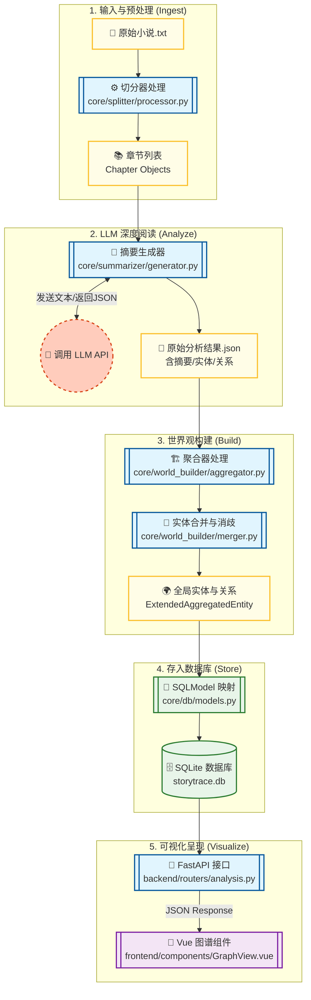

```mermaid
flowchart TD
    %% 定义节点样式
    classDef file fill:#fffde7,stroke:#fbc02d,stroke-width:2px;
    classDef process fill:#e1f5fe,stroke:#01579b,stroke-width:2px;
    classDef llm fill:#ffccbc,stroke:#d84315,stroke-width:2px,stroke-dasharray: 5 5;
    classDef db fill:#e8f5e9,stroke:#2e7d32,stroke-width:2px;
    classDef ui fill:#f3e5f5,stroke:#7b1fa2,stroke-width:2px;

    %% 阶段 1: 原始输入
    subgraph Stage1 ["1. 输入与预处理 (Ingest)"]
        RawTXT["📄 原始小说.txt"]:::file
        SplitterProcess[["⚙️ 切分器处理<br/>core/splitter/processor.py"]]:::process
        ChapterList["📚 章节列表<br/>Chapter Objects"]:::file
    end

    %% 阶段 2: AI 分析 (Analyze)
    subgraph Stage2 ["2. LLM 深度阅读 (Analyze)"]
        SummarizerProcess[["🧠 摘要生成器<br/>core/summarizer/generator.py"]]:::process
        LLMService(("🤖 调用 LLM API")):::llm
        RawJSON["📝 原始分析结果.json<br/>含摘要/实体/关系"]:::file
    end

    %% 阶段 3: 数据聚合 (Aggregate)
    subgraph Stage3 ["3. 世界观构建 (Build)"]
        AggregatorProcess[["🏗️ 聚合器处理<br/>core/world_builder/aggregator.py"]]:::process
        MergerProcess[["🔗 实体合并与消歧<br/>core/world_builder/merger.py"]]:::process
        GlobalEntity["🌍 全局实体与关系<br/>ExtendedAggregatedEntity"]:::file
    end

    %% 阶段 4: 持久化存储 (Persist)
    subgraph Stage4 ["4. 存入数据库 (Store)"]
        DBModels[["💾 SQLModel 映射<br/>core/db/models.py"]]:::db
        SQLiteDB[("🗄️ SQLite 数据库<br/>storytrace.db")]:::db
    end

    %% 阶段 5: 前端展示 (Render)
    subgraph Stage5 ["5. 可视化呈现 (Visualize)"]
        APIServer[["🚀 FastAPI 接口<br/>backend/routers/analysis.py"]]:::process
        FrontendGraph[["🎨 Vue 图谱组件<br/>frontend/components/GraphView.vue"]]:::ui
    end

    %% 数据流向连线
    RawTXT --> SplitterProcess
    SplitterProcess --> ChapterList
    
    ChapterList --> SummarizerProcess
    SummarizerProcess <-->|"发送文本/返回JSON"| LLMService
    SummarizerProcess --> RawJSON
    
    RawJSON --> AggregatorProcess
    AggregatorProcess --> MergerProcess
    MergerProcess --> GlobalEntity
    
    GlobalEntity --> DBModels
    DBModels --> SQLiteDB
    
    SQLiteDB --> APIServer
    APIServer -->|"JSON Response"| FrontendGraph
```