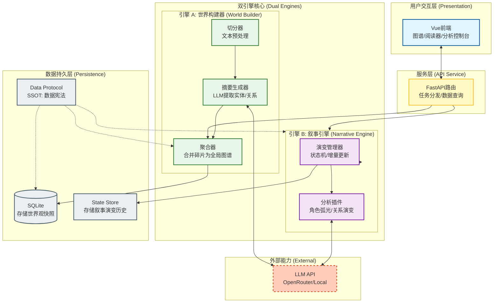

```mermaid
flowchart TD
    %% 定义样式
    classDef frontend fill:#e1f5fe,stroke:#01579b,stroke-width:2px;
    classDef api fill:#fff9c4,stroke:#fbc02d,stroke-width:2px;
    classDef world fill:#e8f5e9,stroke:#2e7d32,stroke-width:2px;
    classDef narrative fill:#f3e5f5,stroke:#7b1fa2,stroke-width:2px;
    classDef data fill:#eceff1,stroke:#455a64,stroke-width:2px;
    classDef llm fill:#ffccbc,stroke:#d84315,stroke-width:2px,stroke-dasharray: 5 5;

    subgraph UserLayer ["用户交互层 (Presentation)"]
        direction TB
        VueFrontend["Vue前端<br/>图谱/阅读器/分析控制台"]:::frontend
    end

    subgraph ServiceLayer ["服务层 (API Service)"]
        direction TB
        FastAPIRouter["FastAPI路由<br/>任务分发/数据查询"]:::api
    end

    subgraph EngineLayer ["双引擎核心 (Dual Engines)"]
        direction TB
        
        subgraph WorldBuilder ["引擎 A: 世界构建器 (World Builder)"]
            direction TB
            Splitter["切分器<br/>文本预处理"]:::world
            Summarizer["摘要生成器<br/>LLM提取实体/关系"]:::world
            Aggregator["聚合器<br/>合并碎片为全局图谱"]:::world
        end
        
        subgraph NarrativeEngine ["引擎 B: 叙事引擎 (Narrative Engine)"]
            direction TB
            EvolutionManager["演变管理器<br/>状态机/增量更新"]:::narrative
            Plugins["分析插件<br/>角色弧光/关系演变"]:::narrative
        end
    end

    subgraph DataLayer ["数据持久层 (Persistence)"]
        direction TB
        Protocol["Data Protocol<br/>SSOT: 数据宪法"]:::data
        SQLDatabase[("SQLite<br/>存储世界观快照")]:::data
        StateStore["State Store<br/>存储叙事演变历史"]:::data
    end

    subgraph ExternalLayer ["外部能力 (External)"]
        LLMService["LLM API<br/>OpenRouter/Local"]:::llm
    end

    %% 连线
    VueFrontend <--> FastAPIRouter
    FastAPIRouter --> Aggregator
    FastAPIRouter --> NarrativeEngine
    
    %% World Builder Flow
    Splitter --> Summarizer
    Summarizer <--> LLMService
    Summarizer --> Aggregator
    Aggregator --> SQLDatabase
    
    %% Narrative Engine Flow
    NarrativeEngine --> EvolutionManager
    EvolutionManager --> Plugins
    Plugins <--> LLMService
    EvolutionManager --> StateStore
    
    %% Protocol Constraint
    Protocol -.-> Aggregator
    Protocol -.-> NarrativeEngine
    Protocol -.-> SQLDatabase
```