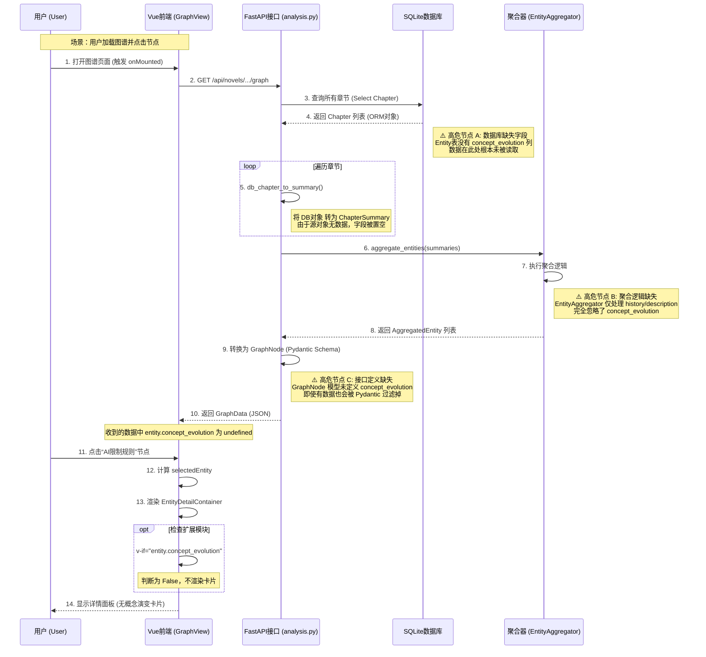

```mermaid
sequenceDiagram
    participant User as 用户 (User)
    participant Vue as Vue前端 (GraphView)
    participant API as FastAPI接口 (analysis.py)
    participant SQLite as SQLite数据库
    participant Aggregator as 聚合器 (EntityAggregator)

    Note over User, Vue: 场景：用户加载图谱并点击节点

    User->>Vue: 1. 打开图谱页面 (触发 onMounted)
    Vue->>API: 2. GET /api/novels/.../graph
    
    API->>SQLite: 3. 查询所有章节 (Select Chapter)
    SQLite-->>API: 4. 返回 Chapter 列表 (ORM对象)
    Note right of SQLite: ⚠️ 高危节点 A: 数据库缺失字段<br/>Entity表没有 concept_evolution 列<br/>数据在此处根本未被读取

    loop 遍历章节
        API->>API: 5. db_chapter_to_summary()
        Note right of API: 将 DB对象 转为 ChapterSummary<br/>由于源对象无数据，字段被置空
    end

    API->>Aggregator: 6. aggregate_entities(summaries)
    
    Aggregator->>Aggregator: 7. 执行聚合逻辑
    Note right of Aggregator: ⚠️ 高危节点 B: 聚合逻辑缺失<br/>EntityAggregator 仅处理 history/description<br/>完全忽略了 concept_evolution

    Aggregator-->>API: 8. 返回 AggregatedEntity 列表

    API->>API: 9. 转换为 GraphNode (Pydantic Schema)
    Note right of API: ⚠️ 高危节点 C: 接口定义缺失<br/>GraphNode 模型未定义 concept_evolution<br/>即使有数据也会被 Pydantic 过滤掉

    API-->>Vue: 10. 返回 GraphData (JSON)
    Note over Vue: 收到的数据中 entity.concept_evolution 为 undefined

    User->>Vue: 11. 点击“AI限制规则”节点
    Vue->>Vue: 12. 计算 selectedEntity
    Vue->>Vue: 13. 渲染 EntityDetailContainer
    
    opt 检查扩展模块
        Vue->>Vue: v-if="entity.concept_evolution"
        Note over Vue: 判断为 False，不渲染卡片
    end
    
    Vue-->>User: 14. 显示详情面板 (无概念演变卡片)
```